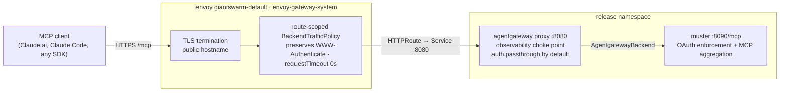
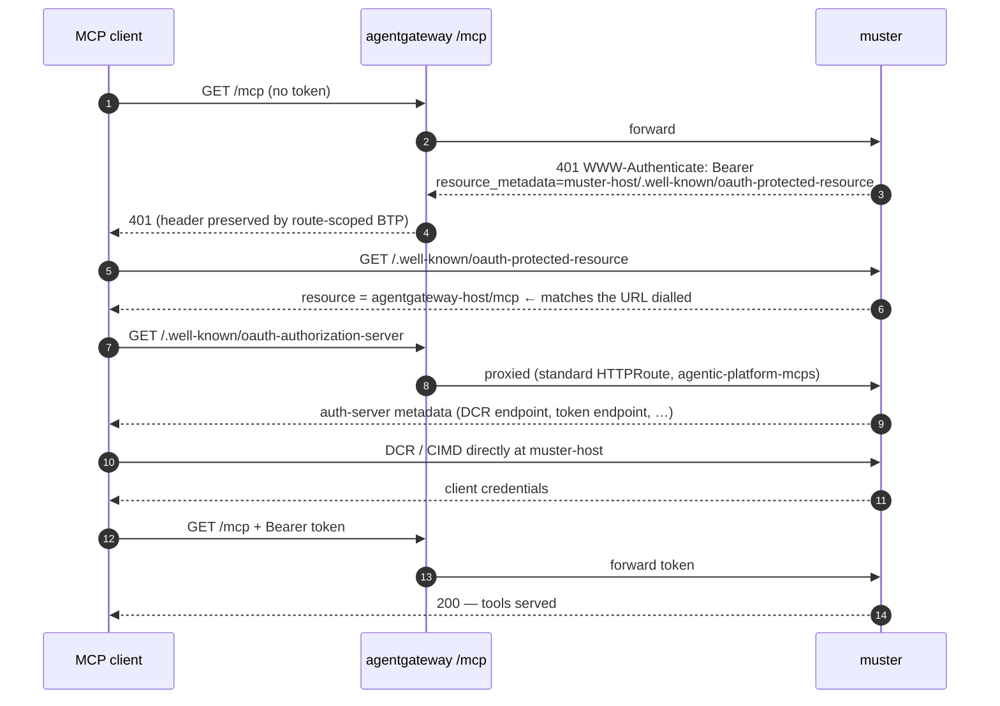
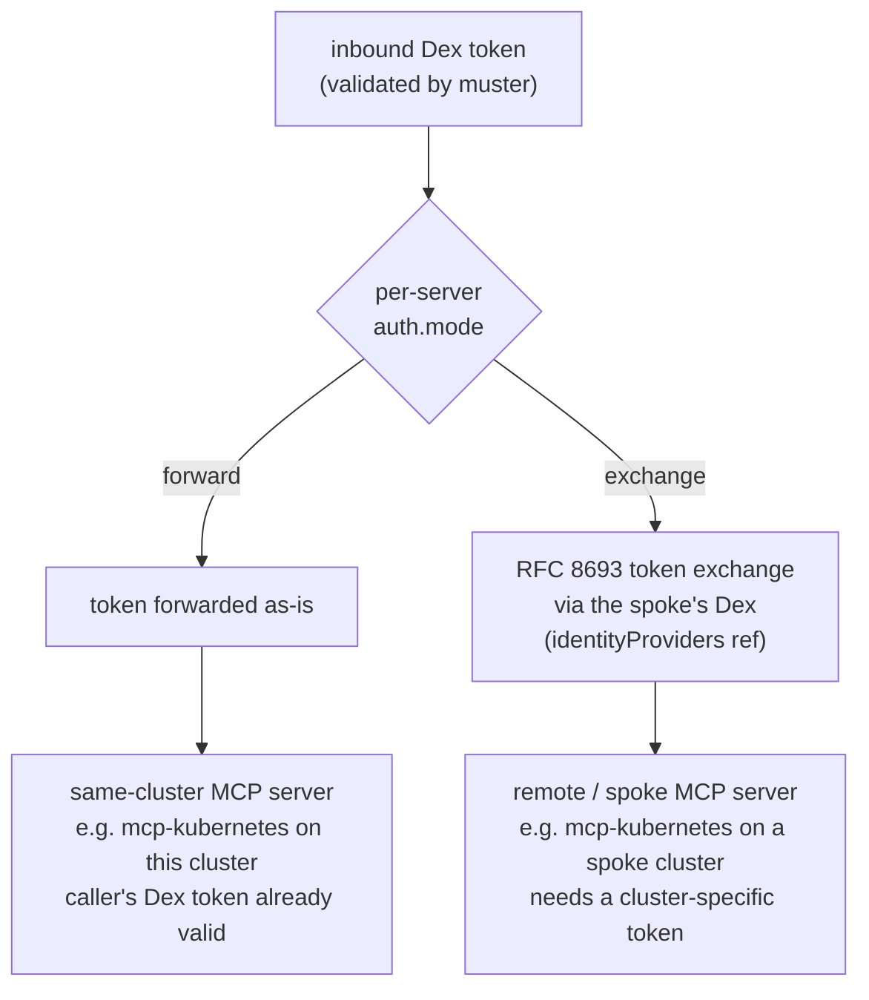
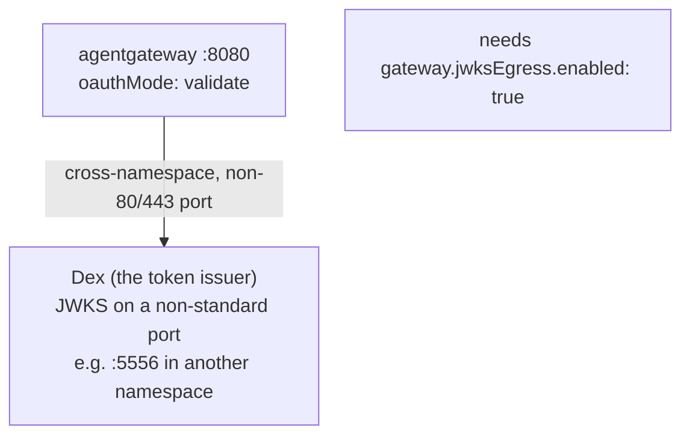

# Authentication flow

How a request authenticates against the agentic platform. This document covers
**only authentication** — TLS termination details and the broader
networking/NetworkPolicy model are described elsewhere (`README.md` →
*Ingress topology* and the `networkpolicy-dataplane-*` templates).

The request topology is selected by `ingress.mode` (see `README.md` →
*Ingress topology*):

- **`muster-direct`** (default) — client → muster directly. There is **one** hop:
  the public Gateway → muster. No agentgateway data plane exists.
- **`agentgateway-muster`** / **`agentgateway-direct`** — client → agentgateway
  `/mcp` → muster (or, in `agentgateway-direct`, the servers). Here a second
  Gateway API hop (agentgateway) sits in front of muster.

This document narrates the **`agentgateway-*`** topology, where agentgateway is
present. In `muster-direct` mode, drop the agentgateway hop: the client reaches
muster directly over the public hop and muster enforces OAuth exactly as
described below.

Each section is one slice of the story with its own diagram:

1. [The request path (who terminates what)](#1-the-request-path)
2. [OAuth discovery — how an unauthenticated client finds the auth server](#2-oauth-discovery)
3. [Token handling at muster — `forward` vs `exchange`](#3-token-handling-at-muster)
4. [Edge JWT validation (`oauthMode: validate`) and JWKS](#4-edge-jwt-validation-and-jwks)

In the `agentgateway-*` modes, the only URL a client is ever given is
**`agentgateway.<cluster>.<base>/mcp`**; muster is a backend implementation
detail and clients never address it for `/mcp`. In `muster-direct` mode the
client is given muster's own `/mcp` URL directly.

---

## 1. The request path

In the `agentgateway-*` modes, two Gateway API hops sit in front of muster. The
**public** hop terminates TLS and owns the hostname; the **agentgateway** hop is
the observability and policy choke point. Authentication itself is still
enforced by muster at the end. (In `muster-direct` mode only the public hop
exists, routing straight to muster.)



What each component is responsible for, in auth terms:

| Hop | Template | Auth responsibility |
|---|---|---|
| envoy `giantswarm-default` | (cluster ingress, not this chart) | Terminates TLS, owns the public hostname. |
| `HTTPRoute` (`/mcp`) | `templates/agentgateway/httproute.yaml` | Routes `/mcp` to the agentgateway Service:8080. Rendered in the `agentgateway-*` modes (`ingress.mode`); reads `ingress.parentRefs` / `ingress.hostnames`. Without it the agentgateway `/mcp` route does not exist. (muster's public `/` route, `templates/ingress/muster-httproute.yaml`, is always rendered.) |
| `BackendTrafficPolicy` | `templates/agentgateway/backendtrafficpolicy.yaml` (agentgateway `/mcp` route) and `templates/ingress/muster-backendtrafficpolicy.yaml` (muster `/` route) | **Critical for auth:** a cluster-wide error-pages `BackendTrafficPolicy` rewrites 4xx/5xx to branded HTML and strips upstream headers — including `WWW-Authenticate`. A route-scoped policy (enabled via `ingress.backendTrafficPolicy.enabled`) takes precedence and preserves muster's `401 … WWW-Authenticate` challenge, without which clients cannot discover where to authenticate. The umbrella renders one over the agentgateway `/mcp` route (`agentgateway-*` modes only) and a complementary one over muster's `/` route (**all** modes) — the latter matters in `muster-direct`, where muster serves `/mcp` directly. Both also set `requestTimeout: 0s` (`ingress.backendTrafficPolicy.timeout`) so long-lived MCP/SSE streams are not killed. |
| agentgateway proxy | `gateway.yaml` + `agentgatewayparameters.yaml` | By default `auth.passthrough` — forwards the bearer token to muster unvalidated. Optionally validates at the edge (§4). |
| muster | `muster` sub-chart | Enforces OAuth, validates the token, aggregates downstream MCP servers, and performs token exchange where needed (§3). |

---

## 2. OAuth discovery

A fresh client arrives with no token. It must discover the authorization server
before it can authenticate. In the `agentgateway-*` modes the challenge is
served by muster but must survive the journey back through both gateway hops —
that is what the route-scoped `BackendTrafficPolicy` (`ingress.backendTrafficPolicy`)
guarantees. (In `muster-direct` mode the challenge travels only the single
public hop, but muster's `/` route still carries its own route-scoped
`BackendTrafficPolicy` so the same cluster-wide error-pages policy cannot strip
`WWW-Authenticate` from the `401` muster serves on `/mcp`.)

The keystone is `muster.oauth.server.resourceIdentifier`, set in shared-configs
to `agentgateway-host/mcp`. It makes muster advertise the **agentgateway**
resource in its own OAuth metadata, so discovery is consistent regardless of
which hostname the client actually reached muster through.



Notes:

- muster's OAuth endpoints (`/.well-known/*`, DCR, token) remain publicly
  reachable on `muster-host`. agentgateway only proxies `/mcp` — Gateway API
  path-specificity (`/mcp` beats `/`) keeps every other path on muster directly.
- Step 5 (`oauth-authorization-server` via agentgateway) is the proxy route
  added by [agentic-platform-mcps](https://github.com/giantswarm/agentic-platform-mcps),
  so the client can do the whole flow against the single agentgateway hostname.

---

## 3. Token handling at muster

Once a valid token reaches muster, muster aggregates many downstream MCP servers
behind one endpoint. Each server entry declares **how** its token is obtained.
This is per-server config in the `agentic-platform-mcps` `mcpServers` list, not a
gateway concern.



| `auth.mode` | When | Mechanism |
|---|---|---|
| `forward` | Downstream server trusts the **same** issuer the caller authenticated with (typically same-cluster). | muster passes the inbound bearer token through unchanged. No exchange. |
| `exchange` | Downstream server lives behind a **different** issuer (a spoke/remote cluster). | muster performs an [RFC 8693](https://www.rfc-editor.org/rfc/rfc8693) token exchange against the spoke's Dex `tokenEndpoint`, using credentials from the `identityProviders.<provider>` entry, to mint a token the downstream server accepts. |

Example (`exchange` against a spoke cluster's Dex):

```yaml
agentic-platform-mcps:
  mcpServers:
    - cluster: <spoke>
      group: kubernetes
      url: https://mcp-kubernetes.<spoke>.<base>/mcp
      auth:
        mode: exchange
        provider: <spoke>          # ref into identityProviders
  identityProviders:
    <spoke>:
      tokenEndpoint: https://dex.<spoke>.<base>/token
      connectorId: giantswarm-simple-oidc
      credentialsSecret:
        name: <spoke>-token-exchange-credentials
        clientIdKey: client-id
        clientSecretKey: client-secret
```

### On behalf of a user: the user's Dex token, forwarded

A kagent agent acts on behalf of the human who invoked it. kagent propagates the
human's Dex-issued token (`KAGENT_PROPAGATE_TOKEN`) as the only `Authorization`
reaching muster — no static per-agent header, no separate actor token. muster
validates that token and, per the downstream server's `auth.mode`, either
forwards it unchanged (`forward`) or exchanges it at the spoke's Dex (`exchange`,
above). muster never signs a token of its own: Dex is the sole SSO authority
(muster v1.0.0 removed JWT mode), so every downstream server validates against
Dex's JWKS, never muster's. The token carries the human only; the agent's own
identity is not asserted downstream.

For mcp-kubernetes the token is a Dex token with `aud=dex-k8s-authenticator`,
which mcp-kubernetes forwards to the kube-apiserver via downstream OAuth — so
Kubernetes RBAC and the audit log reflect the human directly. No muster-issued
token and no impersonation `ClusterRole` are involved.

---

## 4. Edge JWT validation and JWKS

This section applies only to the `agentgateway-*` modes (in `muster-direct` mode
there is no agentgateway and muster is the sole validator). By default
agentgateway runs `auth.passthrough`: it forwards the token to muster
without inspecting it, and muster is the only validator. Optionally, agentgateway
can validate the JWT **at the edge** (`oauthMode: validate`) as a first layer —
muster still validates downstream as a second layer. Edge JWT validation is the
relevant model for `agentgateway-direct`, where agentgateway must gate traffic
on its own. Token exchange (§3) is
unaffected: agentgateway only ever sees the inbound token; muster's internal
RFC 8693 exchanges happen behind it.

### Edge validation validates against Dex, not muster

The default is `oauthMode: passthrough`: agentgateway forwards the token to
muster unchanged, and muster is the sole validator. muster issues only opaque
tokens — v1.0.0 removed `enableJWTMode`/`jwtSigningKey` and the chart schema now
rejects both — and must never be trusted as an issuer.

If an install turns on edge validation (`oauthMode: validate`), agentgateway
verifies the JWT against the issuer that signed it — **Dex** — by fetching Dex's
`/.well-known/jwks.json`. There is no muster JWT mode and no muster JWKS. muster
still validates downstream as the second layer, and token exchange in §3 is
untouched. `resourceIdentifier` (`agentgateway-host/mcp`) remains the audience
the token is bound to, so agentgateway can check `aud` matches the hostname the
client actually dialled.

Edge validation fetches the JWKS from Dex (the token's issuer), which typically
runs in another namespace on a non-standard port, so it needs an explicit
data-plane egress rule.



### When `gateway.jwksEgress` is required

`gateway.jwksEgress` is an `agentgateway-*` data-plane knob (most relevant to
`agentgateway-direct`, where agentgateway validates JWTs at the edge against an
external key set).

The data-plane NetworkPolicy
(`networkpolicy-dataplane-{cilium,kubernetes}.yaml`) allows the proxy egress to
muster:8090 and the agentgateway controller:9978 by default. Fetching JWKS from
anywhere else is blocked unless you open it explicitly:

- **Default (`oauthMode: passthrough`):** no JWKS fetch — muster is the sole
  validator. Leave `gateway.jwksEgress.enabled: false`.
- **Edge validation (`oauthMode: validate`) against Dex:** Dex's JWKS (typically
  on `:5556`) runs in another namespace on a port the default cluster egress
  rules (80/443) don't cover. Enable the rule:

  ```yaml
  gateway:
    jwksEgress:
      enabled: true
      namespace: giantswarm     # where Dex lives
      port: 5556                # Dex's JWKS port
      podSelector: {}           # optional: narrow beyond namespace
  ```

### Enabling edge validation

1. `oauthMode: validate` on agentgateway, with `jwt.jwksBackendRef` pointing at
   the Dex that issued the tokens (set in shared-configs).
2. `gateway.jwksEgress.enabled: true` with Dex's namespace and JWKS port, so the
   data plane may reach it (see above).

> muster is not involved in edge validation and signs nothing: v1.0.0 removed
> `enableJWTMode`/`jwtSigningKey` and the chart schema rejects them.
